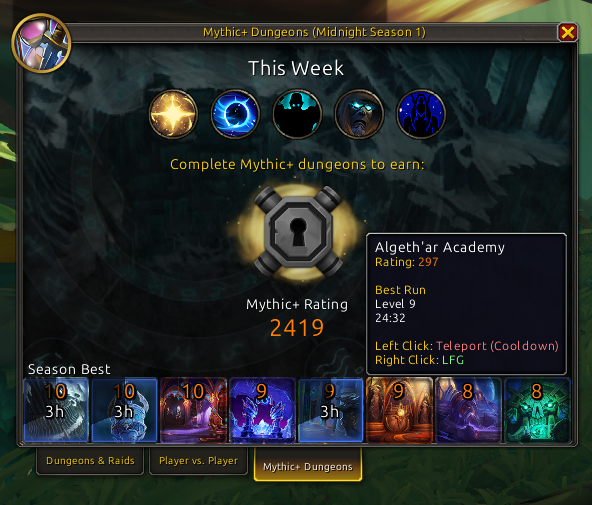

# 🗺️ MinimapAutoZoom

Automatically zooms out the minimap after a configurable delay.

This allows a fully zoomed out minimap to become the new default state.

- Never need to realize you forgot to zoom out again.
- Never need to zoom out manually again.

## Usage

- (Optional) Open settings:
  - from:
    - Options->AddOns menu
    - Addon Compartment menu
    - Type: `/maz`
  - Set the delay (default: 3 seconds)
- Zoom in on the minimap; it will automatically zoom out after the delay
